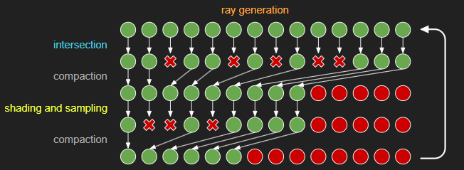
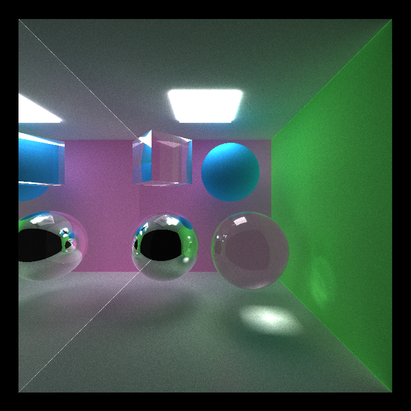
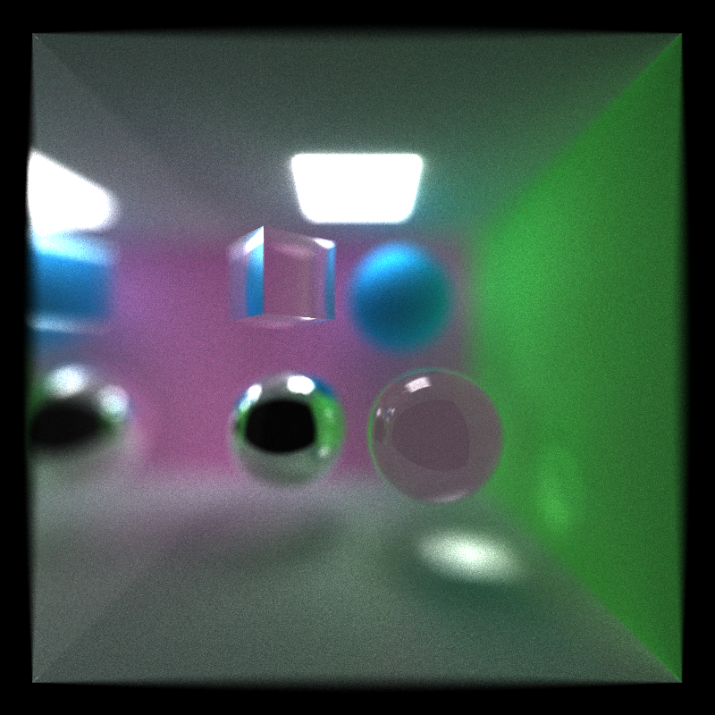
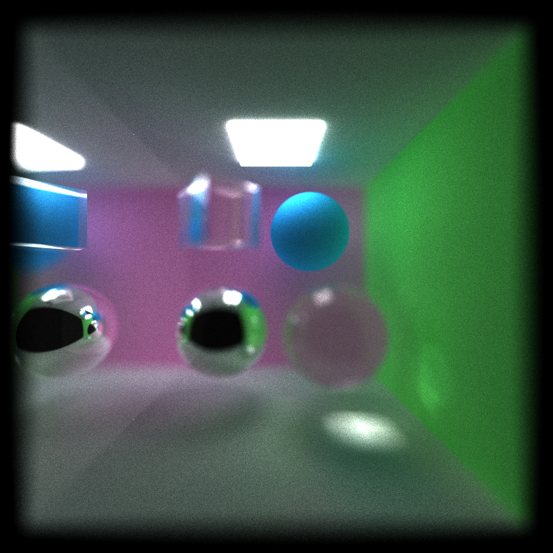
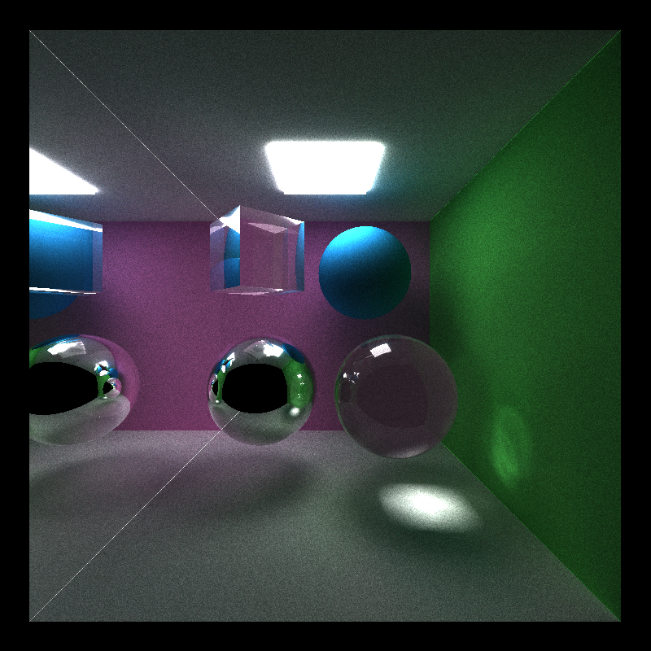

# CUDA Path Tracer

**University of Pennsylvania, CIS 5650: GPU Programming and Architecture, Project 3**

**Author:** Lu Men ([LinkedIn](https://www.linkedin.com/in/lu-m-673425323/))

**Tested System:**
 - Windows 11 Home
 - AMD Ryzen 7 5800HS @ 3.20GHz, 16GB RAM
 - NVIDIA GeForce RTX 3060 Laptop GPU 6GB (Compute Capability 8.6)

## Abstract

This project implements a GPU path tracer written in CUDA that renders images. The implementation focuses on both visual correctness and GPU performance. The tracer supports multiple sampling strategies and a thin-lens camera model for depth-of-field.


## Features

### 1) Core BSDFs

- Diffuse (Lambertian): cosine-weighted hemisphere sampling with albedo-based BRDF.
- Specular reflectance: perfect mirror reflection for specular materials.


### 2) Intersections sorted by material

Grouping intersections by material ID creates contiguous memory reads in the shading kernel, improving cache behavior and reducing memory latency on the GPU.

### 3) Stream compaction (remove dead/non-bouncing paths)

After shading, rays that are terminated (dead) are removed from the active ray list using parallel stream compaction. This reduces the number of rays traced in future iterations.



### 4) Russian roulette

During shading, rays that have many remaining bounces and insignificant color intensities are randomly terminated. This reduces the number of rays traced in future iterations. We compensate surviving paths by dividing throughput by the survival probability.

| Original | Russian roulette |
|:-----------------------------:|:-----------------------------:|
|  |  |

### 4) Stochastic antialiasing

Antialiasing is performed by jittering sample positions within each pixel across multiple samples per pixel. This reduces aliasing and helps Monte Carlo convergence.

| Original | Anti-aliasing |
|:---------------------:|:-----------------:|
|  |  |

### 5) Refraction

Dielectric materials use Snell's law to compute transmission directions and Schlick's approximation for Fresnel reflectance. Total internal reflection is handled explicitly.


### 6) Depth-of-field (customizable aperture & focus distance)

Implemented using a thin-lens camera: sample the lens disk and aim rays at a point on the focal plane located at the focus distance. The aperture controls blur amount.

| No DoF (sharp) | Focused on front glass sphere | Focused on back blue sphere |
|:--------------:|:-------------:|:------------:|
|  |  |  |

### 7) Direct lighting

Direct lighting samples scene lights per hit point. We compute a visibility test toward sampled light points and add contribution scaled by distance (and normalized by the light intensity to emphasize contrast in lit regions). This requires a separate pass / kernel for sampling lights and visibility checks, so it is more expensive but increases visual fidelity.

```
for each lightSample {
	Lp = samplePointOnLight(light);
	wi = normalize(Lp - hit.pos);
	if (!occluded(hit.pos, Lp)) {
		Li = light.power / distanceSquared(hit.pos, Lp);
		contribution += brdf * Li * max(0, dot(wi, normal)) / pdf;
	}
}
contribution *= normalizeByLightIntensity(light);
```


| Original | With direct lighting |
|:--------------------:|:-----------------------:|
|  |  |

### 9) Monte Carlo sampling strategies

Supported 2D random number generators: uniform, purely random, jittered, Halton, and Sobol. Samplers are used for pixel jitter, lens sampling, and BRDF sampling. Low-discrepancy sequences often improve convergence but can introduce structured artifacts unless scrambled.

## Results and Performance Summary

Representative performance numbers measured on the development machine (scene dependent):

- Baseline (no extra features): 12.0 FPS
- With Russian roulette enabled: 13.1 FPS
- With Direct Lighting enabled: 10.8 FPS (extra kernel invocation for direct lighting visibility computations)

Observations:
- Sorting intersections by material reduced memory stalls in the shading kernel.
- Stream compaction significantly reduces traced rays in later bounces, improving throughput; however, the relative benefit depends on scene complexity and depth distribution.
- Direct lighting increases image quality but requires additional computation; use it when higher fidelity is required.

## Bloopers

## References and Acknowledgements

This project adapted methods and pseudocode from these well-known references:

- [_Physically Based Rendering_](https://pbr-book.org/4ed/contents)
- [_Ray Tracing in One Weekend_](https://raytracing.github.io/books/RayTracingInOneWeekend.html)
- [_The path to path-traced movies_](https://cs.dartmouth.edu/~wjarosz/publications/christensen16path.html)
- [_CIS 5650 Fall 2025_](https://github.com/CIS5650-Fall-2025)

Acknowledgements: Many thanks to the authors and open-source materials. Code structure and many algorithmic choices were influenced by course materials and the references above.
